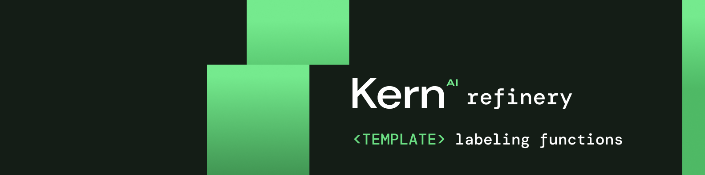

In this repository, you can find sample labeling functions for classification and extraction tasks.

If you like what we're working on, please leave a ⭐ for [refinery](https://github.com/code-kern-ai/refinery)!

## Usage
There are two `README`s:
- [classifier labeling functions](classification/README.md)
- [extraction labeling functions](extraction/README.md)

Depending on your task at hand, please look into the respective `README`.

## About labeling functions
Generally, labeling functions can be:
- Pattern matching, such as in regular expressions
- Third party models, e.g. sentiment classifiers or legacy systems
- Lookups in lists or databases, such as a list of known organizations
- General heuristics, such as grammar checks
- Metadata-based functions, e.g. predicting on the value of other attributes

## Contributing
Contributions are what make the open source community such an amazing place to learn, inspire, and create. Any contributions you make are **greatly appreciated**.

If you have a suggestion that would make this better, please fork the repo and create a pull request. You can also simply open an issue with the tag "enhancement". If you know great labeling functions, you can add them there!

And please don't forget to leave a ⭐ if you like the work! 

## License
Distributed under the Apache 2.0 License. See LICENSE.txt for more information.

## Contact
This library is developed and maintained by [kern.ai](https://github.com/code-kern-ai). If you want to provide us with feedback or have some questions, don't hesitate to contact us. We're super happy to help ✌️
